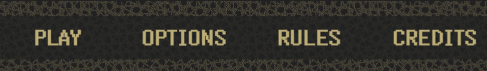
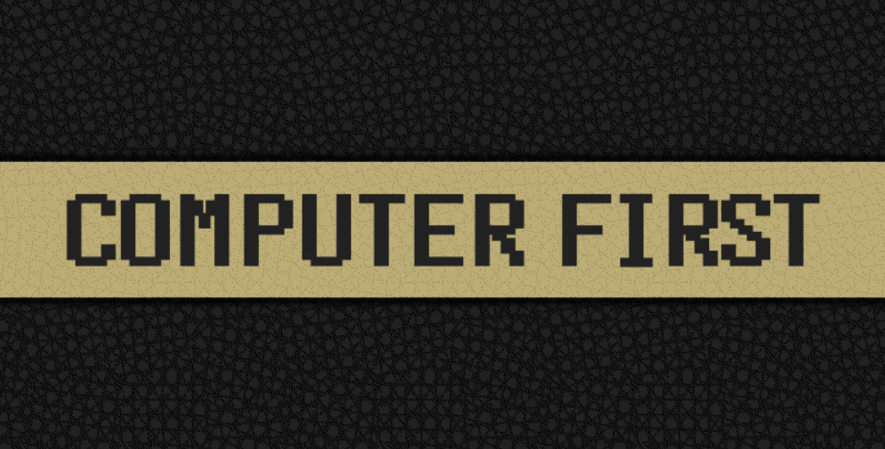
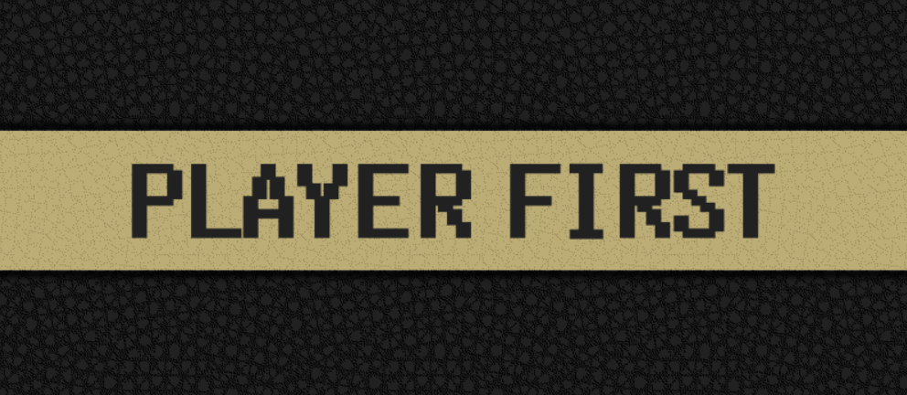
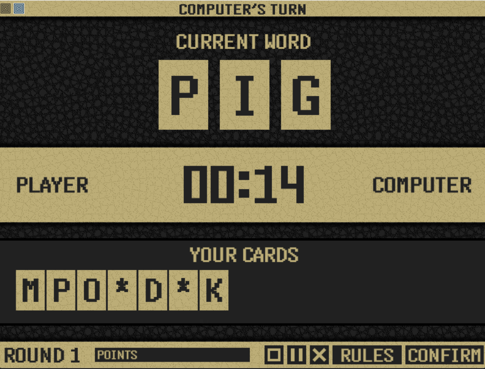

# Game Overview:
   [ The Word Battle 🃏
    welcome to our game the high risk card game 
    where letters are your bullets and words are your weapons
    and your mined is your greatest ally.Ready Let’s go! ]

# Game Basics (●'◡'●):
1. Deck Size: 40 letter cards
2. Players: You🧍 vs computer 🤖
3. Starting Cards: Each player gets 7 random letter cards and possibly Star Card ✨
4. Starting Word: random 3-letter word

# How to play🤔:
1. player takes turns 🔁
2. On each turn there will be a 15 seconds timer ⏱️ to change
   ONE letter in the current word to form a new valid word.
3. In that time the player must change ONE letter in the current
    word by using one of their letter cards to form a new valid word

# Penalties ❗:
## A new card will be given to you do on of these :
1. Didn’t make a move in time ⏰
2. Played invalid word 

## Reached 15 cards?? You’re out. Game over ☠️

# Star Card Power ⭐:
1. Use Star Card anytime to replace any one letter in the word with a ⭐ wildcard.
2. Star cards are useful if you are stuck and can’t change the current word with your
    letters because it will change the current word to a new random word
3. The computer will try every alphabet letter in that position of the star card to
    find a real word.
4. If no real word is found, you get a Penalty card! 😈

# Bot Levels 💪:
🟢 Level 1: Easy 
🟡 Level 2: Medium
🔴 Level 3: Hard

# Win Rewards🏆:
For every time you change a word you will earn a point if you reach 3 points you 
can remove 1 card from your hand. This is useful to remove difficult words 😊

# How to Win:
1. Every time you make a valid word you get rid of 1 card 😜
2. First to zero cards wins the game 😍🎉🏆
3. If either you or the computer collects 15 cards, that player
    will be out of the game ☠️😵‍💫

# Coin Flip (Who Goes First?)🪙
At the start of the game a coin flip decides who makes the first move 
wish luck to be on your side 😊

##### Ready???? Let’s go 🤗

# How To Use The Interface Of The Game🃏🧩✨:

## 1. Welcome Page 😊:

When you run the game you will see a welcome page.
There you will have the game name and four buttons.

## 2. Main Menu Buttons 🔘:

There are four buttons on the welcome page:

1.     Play: Starts the game.
2.     Options: Mute music,change theme.
3.     Rules : Displays the game rules.
4.     Credits: Names of the people who created the game
   
## 3. Computer Difficulty 💪: 
After clicking the Play button, you’ll be asked to choose the difficulty level of the bot.

## 4. Coin flip 🪙:
A coin flip will decide who plays first—you or the bot.
A screen will display the result before the game begins.

   

   

## 5. Gameplay Interface 🕹️:

- The word to modify appears at the top.
- The timer is in the middle.
- Your cards are shown at the bottom.
- At the bottom, you’ll also find:
  - Points 
  - Number of rounds
  - Pause Game
  - Exit Game
  - Game Rules
  - Confirm to Next Round
  - To click a button in the game,just click it.
  - To change a letter in the word:
    1. Click one of your letter cards.
    2. Then click the letter in the word you want to replace.
    3. Then make sure to click CONFIRM

    
# Software requirements 🌐:
1. Download Python version (3.12) you can install it from Python'S  official website
    https://www.python.org/downloads/.
 
2. Code editor: You can use any code editor, but PyCharm is recommended for 
    its powerful features and easy to use.You can download PyCharm from
    https://www.jetbrains.com/pycharm/download/?section=windows.

3. Python packages: The game requires the Pygame package to run.To install it:
    - Open the terminal or command prompt on your computer (This step will be explained below).
    - Type the following command and press Enter:pip install pygame

4. Script Permissions: No special permissions needed to run this game in
    PyCharm. 

# Hardware Requirements 💻
It’s recommended to have at least 100MB of available RAM for optimal performance.

# Instructions to run code 🏃‍♂️➡️️
1. Install Python
   - Download Python 3.13 from (https://www.python.org/downloads/).
   - Make sure to check "Add Python to PATH" during installation.✔️
   - Need help?? Watch this video(https://www.youtube.com/watch?v=YYXdXT2l-Gg).😥📺
   
2. Install a Code Editor (Recommended PyCharm)
   - Download PyCharm from (https://www.jetbrains.com/pycharm/download/?section=windows).
   
3. Install Pygame:
    - Windows: open the command prompt. 
    - Mac: Press Cmd + Space, type Terminal.
    - Linux: Use the system terminal,type and run (pip install pygame).
   
4. Download the Game Files from this github link()

5. Run the game
   - Open PyCharm and load the folder with the game files.
   - Right-click the main game file (e.g., main.py) and select Run.OR Open the terminal, go to the game folder, and type:
        - python main.py
        OR
        - python3 main.py
   - Need help with this step? Watch(https://www.youtube.com/watch?v=m1k6H9F_NNc)).

# Contributions Statement
1. Raghad Aljubran (5635869)
    - Originated the game concept for Word Clash: The Letter Battle
    - Created the User Guide documenting gameplay rules and instructions
    - Developed foundational game mechanics:
        - Word validation(BFS algorithm)
        - Dictionary System
        - Card System Architect
        - Star Card wildcard logic
        - Card stack generation (Fisher-Yates shuffle)
        - Coin flip turn-order system
        - Algorithm for sorting
      
2. Hasan Alwazzan (5640356)
   - Supervised project integration and quality assurance
   - Created Bot AI system with Three difficulty modes
       (Easy/Medium/Hard) with distinct behaviors
   - Turn timing simulation:
       Probabilistic turn skipping (will_answer_or_not())
   - Word validation engine
   - Card management
   - Letter frequency analysis
   - Edge Case Handling
   - Linguistic Algorithms
- Developed GameSettings configuration module

3. Jiaxi Huang (5670238)
- Designed and implemented the graphical interface (Pygame):
- Welcome screen, main menu, and gameplay screens
- Interactive UI elements (buttons, card displays, timer)
- Theme system (light/dark mode)
- Assisted with game logic integration

4. Leen (5663960)
   - Implemented main game loop and turn logic
   - Developed:
       - Card interaction and reorganization system
       - Penalty card distribution
       - Score tracking
   - Standardized code style for consistency
   - Assisted with game logic integration

    
Signatures
We confirm these contributions accurately represent our work on Word Battle.

Raghad Aljubran 🖋️
Hasan Alwazzan 🖋️
Jiaxi Huang 🖋️
Leen 🖋️

   
    
                 

        
    

